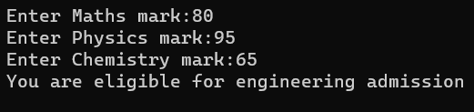

# <p align="middle"> Eligibility-for-Admission</p>

## Aim:
To write a C# program to find the eligibility for admission to an engineering course.

## Algorithm:
### Step1:
Start by creating a new class.

### Step2:
Initiate the integer variables to assign the marks of Maths, Physics and Chemistry and read the input from the user.

### Step3:
Calculate the first total that sums all the 3 subject marks; and the second total that sums maths and physics marks.

### Step4:
Based on the given condition, check whether the student is eligible for the engineering admission.

### Step5:
Display the output for the input read from the user

### Step6:
Stop the execution.
## Program:
#### Developed by: Saravana Kumar S
#### Reg No: 212221230088
```c#
using System;
namespace ex1
{
    public class Program
    {
        public static void Main()
        {
            int mat, phy, chem, sum1, sum2;
            Console.Write("Enter Maths mark:");
            mat = Convert.ToInt32(Console.ReadLine());
            Console.Write("Enter Physics mark:");
            phy = Convert.ToInt32(Console.ReadLine());
            Console.Write("Enter Chemistry mark:");
            chem = Convert.ToInt32(Console.ReadLine());
            sum1 = mat + phy + chem;
            sum2 = mat + phy;
            if (mat >= 65 && phy >= 55 && chem >= 50)
            {
                if (sum1 >= 180 || sum2 >= 140)
                {
                    Console.WriteLine("You are eligible for engineering admission");
                }
                else
                {
                    Console.WriteLine("Sorry! You are NOT eligible for engineering admission");
                }
            }
            else { Console.WriteLine("Sorry! You are NOT eligible for engineering admission"); }

        }
    }

}

```
## Output:




## Result:
Thus, a C# program to check the eligibility of a student on engineering admission has been executed successfully.
